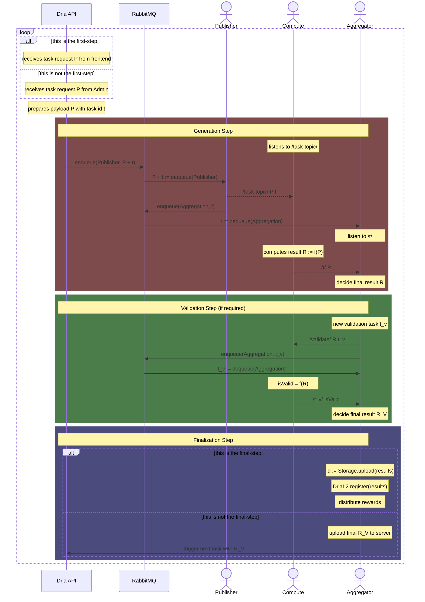

# Dria Knowledge Network: General Flow

Below is a generic sequence diagram that captures the life-cycle of a Dria Knowledge Network task. The actors are as follows:

- `Dria API` and `RabbitMQ` are centralized services that belong to Dria, and do **not** interact with the Waku network.
- `Publisher` and `Aggregator` are instances of [Admin](https://github.com/firstbatchxyz/dkn-admin-node) nodes. Most often, a task is published from one Publisher, and may be aggregated with several Aggregator nodes.
- `Compute` is an instance of [Compute](https://github.com/firstbatchxyz/dkn-compute-node) node. This node can handle arbitrary tasks, such as Synthesis, Validation, and Search.

The dotted lines within the diagram indicate that the message is sent over the Waku network. Lower-level details such as message authenticity and encryption are not shown here, but one may assume that:

- all messages from Admin to Compute are sent with an authentic one-time signature with respect to task id
- all messages from Compute to Admin are sent such that the results are encrypted with the public key of whose private key pair is in the hands of the receiving Aggregator

A task as a whole may compose of several steps, and each step goes through the sequence below, hence the `loop` statement above. At the final step, the results along with the transcript of the entire process are uploaded to a decentralized permanent storage network. An identifier that points to this uploaded data is then stored on DriaL2 within the registry.

## Synthetic Data Generation Flow

Assuming $k$ compute nodes and $n$ validator nodes, the **Distribution** field indicates from how many compute nodes to how many validator nodes a result is distributed.

| #             | Step Name      | Distribution | Validation                  | Is Live      |
| ------------- | -------------- | ------------ | --------------------------- | ------------ |
| 1 (**First**) | Topic-Tree     | $1 \to n$    | ✅ (`Validator`)            | ❌           |
| 2             | Question       | $1 \to n$    | ✅ (`Validator`)            | ✅           |
| 3             | Answer         | $1 \to n$    | ✅ (`Validator`)            | ✅           |
| 4             | Groundtruth    | Centralized  | ❌ (`Dria`)                 | ❗ Partially |
| 5             | Prompt         | Centralized  | ❌ (`Dria`)                 | ❗ Partially |
| 6 (**Final**) | Data Synthesis | $k \to n$    | ✅ (`MaxSim` + `Validator`) | ✅           |
